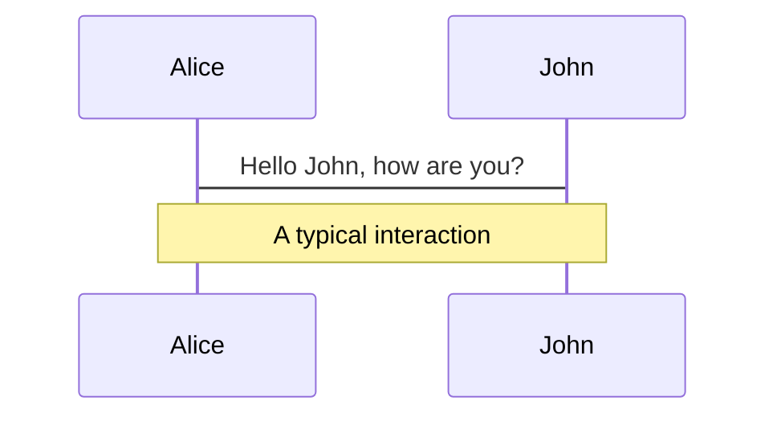
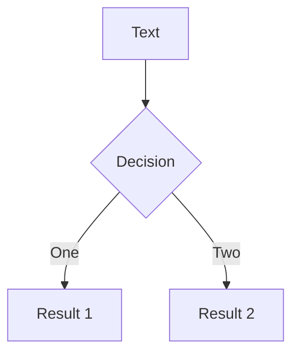

---
# try also 'default' to start simple
theme: seriph

# random image from a curated Unsplash collection by Anthony
# like them? see https://unsplash.com/collections/94734566/slidev
background: https://source.unsplash.com/collection/94734566/1920x1080

# apply any windi css classes to the current slide
class: 'text-center'

# https://sli.dev/custom/highlighters.html
highlighter: shiki

# some information about the slides, markdown enabled
info: |
  ## LyonJS - Talk sur Prisma 
  Mercredi 21 juillet 2021

  Par [Cédric Nicoloso](https://cedric.nicoloso.me/)

layout: cover
---

# Bienvenue au LyonJS #68

<div class="flex justify-center">
  
</div>

<div class="pt-12">
  <span @click="$slidev.nav.next" class="px-2 py-1 rounded cursor-pointer" hover="bg-white bg-opacity-10">
    Press Space for next page <carbon:arrow-right class="inline"/>
  </span>
</div>

<!--
## Et ben, bienvenue à toutes et à tous.  

### On est ravi de pouvoir vous accueillir ici chez Indy pour ce nouveau LyonJS.

### On va attaquer le premier talk...
### Et je vais prendre une vingtaine de minutes pour vous parler de Prisma.
-->


---

## Prisma

<!--
(Sondage rapide, qui a déjà entendu parler de Prisma ?)
-->


---

## Prisma, qu'est-ce que c'est ?

<div class="text-xl mt-8">
  Prisma fait parti de <strong>la famille des ORMs</strong>.
</div>

<div class="mt-12">
  
</div>

<div v-click class="absolute top-95 left-100">
  <ul>
    <li>REST</li>
    <li>GraphQL</li>
  </ul>
</div>

<div v-click class="absolute top-95 left-190">
  <ul>
    <li>SQLite</li>
    <li>MySQL</li>
    <li>PostgreSQL</li>
    <li>
      SQL Server <span class="chip">Preview</span>
    </li>
    <li>
      MongoDB <span class="chip">Early Access</span>
    </li>
  </ul>
</div>

<style>
.chip {
  color: rgb(160, 174, 192);
  font-size: 0.875rem;
  font-style: normal;
  font-weight: 600;
  background: rgb(237, 242, 247);
  border-radius: 5px;
  padding: 2px 5px;
}
.chip.chip-light {
  color: rgba(160, 174, 192, 0.5);
  background: rgba(237, 242, 247, 0.2   );
}
</style>

<!--
#### En gros il va se placer entre notre code serveur et la base de données, et son rôle ça va être de nous :  
### → faciliter la vie dans ces interactions avec la base de données.
-->


---

## Autres candidats

### Contexte : PostgreSQL

<div grid="~ cols-4 gap-2" class='h-full pt-10 pb-20'>

<div class="flex items-center justify-center border-r">
  <div>
    <a href="https://github.com/brianc/node-postgres" target="_blank" class="text-3xl">
      pg
    </a>
    <div class="mt-3">
      → Le driver natif JS pour PostgreSQL
    </div>
  </div>
</div>

<div class="flex items-center justify-center border-r">
  <div>
    <a href="https://github.com/knex/knex" target="_blank" class="text-3xl">
      knex
      
    </a>
    <div class="mt-3">
      → Un query builder
    </div>
    <div class="mt-3">
      <GithubStars count="14.4k" />
    </div>
  </div>
</div>

<div class="flex flex-col content-center items-end">
  <div style="width: 150px;">
    <a href="https://github.com/sequelize/sequelize" target="_blank" class="text-2xl">
      Sequelize
      
    </a>
    <div class="mt-4">
      <GithubStars count="24.6k" />
    </div>
  </div>
  <div class="mt-10" style="width: 150px;">
    <a href="https://github.com/typeorm/typeorm" target="_blank" class="text-2xl">
      TypeORM
      
    </a>
    <div class="mt-4">
      <GithubStars count="24.9k" />
    </div>
  </div>
  <div class="mt-10" style="width: 150px;">
    <a href="https://github.com/mikro-orm/mikro-orm" target="_blank" class="text-2xl">
      MikroORM
      
    </a>
    <div class="mt-4">
      <GithubStars count="3.3k" />
    </div>
  </div>
</div>

<div class="flex flex-col content-center items-center">
  <div class="mt-10">
    <a href="https://github.com/bookshelf/bookshelf" target="_blank">
      Bookshelf.js
      
    </a>
    <div class="mt-4">
      <GithubStars count="6.2k" />
    </div>
  </div>
  <div class="mt-10">
    <a href="https://github.com/Vincit/objection.js" target="_blank">
      Objection.js
    </a>
    <div class="mt-4">
      <GithubStars count="6.2k" />
    </div>
  </div>
</div>

</div>

<!--
### pg : On est au plus proche de la bdd, c'est top, en terme de perfs, etc. Mais on est un peu à poil, à écrire nos requêtes SQL sans auto-complétion dans l'IDE, sans type-checking, etc.

#### knex, l'entre-deux. Des méthodes helpers pour écrire nos requêtes, on se sent un peu plus en sécurité.

#### knex est parfois la base de l'ORM : Objection.js, MikroORM, Bookshelf.js, etc.
-->


---

## Components

<div grid="~ cols-2 gap-4">
  <div>
  
  You can use Vue components directly inside your slides.
  
  We have provided a few built-in components like `<Tweet/>` and `<Youtube/>` that you can use directly. And adding your custom components is also super easy.
  
  ```html
  <Counter :count="10" />
  ```
  
  <!-- ./components/Counter.vue -->
  <Counter :count="10" m="t-4" />
  
  Check out [the guides](https://sli.dev/builtin/components.html) for more.
  
  </div>
  <div>

  <Tweet id="1400893865196879873" scale="0.65" />

  </div>
</div>


---
class: px-20
---

## Themes

Slidev comes with powerful theming support. Themes can provide styles, layouts, components, or even configurations for tools. Switching between themes by just **one edit** in your frontmatter:

<div grid="~ cols-2 gap-2" m="-t-2">

```yaml
---
theme: default
---
```

```yaml
---
theme: seriph
---
```


</div>

Read more about [How to use a theme](https://sli.dev/themes/use.html) and
check out the [Awesome Themes Gallery](https://sli.dev/themes/gallery.html).


---
preload: false
---

## Animations

Animations are powered by [@vueuse/motion](https://motion.vueuse.org/).

```html
<div
  v-motion
  :initial="{ x: -80 }"
  :enter="{ x: 0 }">
  Slidev
</div>
```

<div class="w-60 relative mt-6">
  <div class="relative w-40 h-40">
    
    
    
  </div>

  <div 
    class="text-5xl absolute top-14 left-40 text-[#2B90B6] -z-1"
    v-motion
    :initial="{ x: -80, opacity: 0}"
    :enter="{ x: 0, opacity: 1, transition: { delay: 2000, duration: 1000 } }">
    Slidev
  </div>
</div>

<!-- vue script setup scripts can be directly used in markdown, and will only affects current page -->
<script setup lang="ts">
const final = {
  x: 0,
  y: 0,
  rotate: 0,
  scale: 1,
  transition: {
    type: 'spring',
    damping: 10,
    stiffness: 20,
    mass: 2
  }
}
</script>

<div
  v-motion
  :initial="{ x: 35, y: 40, opacity: 0 }"
  :enter="{ y: 0, opacity: 1, transition: { delay: 3500 } }">

[Learn More](https://sli.dev/guide/animations.html#motion)

</div>


---

## LaTeX

LaTeX is supported out-of-box powered by [KaTeX](https://katex.org/).

<br>

Inline $\sqrt{3x-1}+(1+x)^2$

Block
$$
\begin{array}{c}

\nabla \times \vec{\mathbf{B}} -\, \frac1c\, \frac{\partial\vec{\mathbf{E}}}{\partial t} &
= \frac{4\pi}{c}\vec{\mathbf{j}}    \nabla \cdot \vec{\mathbf{E}} & = 4 \pi \rho \\

\nabla \times \vec{\mathbf{E}}\, +\, \frac1c\, \frac{\partial\vec{\mathbf{B}}}{\partial t} & = \vec{\mathbf{0}} \\

\nabla \cdot \vec{\mathbf{B}} & = 0

\end{array}
$$

<br>

[Learn more](https://sli.dev/guide/syntax#latex)


---

## Diagrams

You can create diagrams / graphs from textual descriptions, directly in your Markdown.

<div class="grid grid-cols-2 gap-10 pt-4 -mb-6">





</div>

[Learn More](https://sli.dev/guide/syntax.html#diagrams)


---
layout: center
class: text-center
---

# Learn More

[Documentations](https://sli.dev) · [GitHub](https://github.com/slidevjs/slidev) · [Showcases](https://sli.dev/showcases.html)
